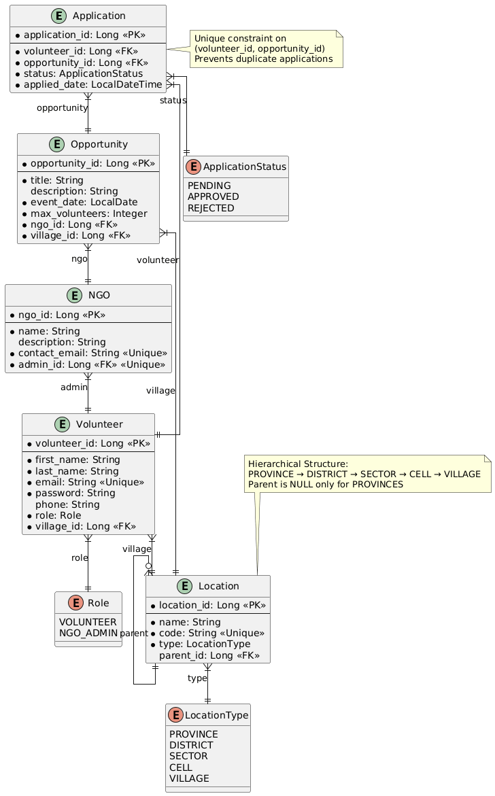

# VolunteerSync - Volunteer Management System

## 📋 Project Overview

VolunteerSync is a comprehensive Spring Boot-based volunteer management system designed to connect NGOs with volunteers in Rwanda. The platform demonstrates mastery of Spring Boot web technologies while solving real-world volunteer coordination challenges across Rwanda's administrative structure.

## 🎯 Project Implementation Requirements Fulfillment

### ✅ **Requirement 1: Project Structure with 5+ Entities**

Our project exceeds this requirement with **5 well-defined entities**, each implementing complete CRUD operations:

| Entity | CRUD Endpoints | Description |
|--------|----------------|-------------|
| **Volunteer** | `POST /api/volunteers`<br>`GET /api/volunteers/{id}`<br>`PUT /api/volunteers/{id}`<br>`DELETE /api/volunteers/{id}` | System users with role-based access |
| **NGO** | `POST /api/ngos`<br>`GET /api/ngos/{id}`<br>`PUT /api/ngos/{id}`<br>`DELETE /api/ngos/{id}` | Organizations posting opportunities |
| **Opportunity** | `POST /api/opportunities`<br>`GET /api/opportunities/{id}`<br>`PUT /api/opportunities/{id}`<br>`DELETE /api/opportunities/{id}` | Volunteer tasks/events |
| **Application** | `POST /api/applications/apply`<br>`GET /api/applications/{id}`<br>`PATCH /api/applications/{id}/status`<br>`DELETE /api/applications/{id}` | Volunteer opportunity applications |
| **Location** | `POST /api/locations`<br>`GET /api/locations/{id}`<br>`PUT /api/locations/{id}`<br>`DELETE /api/locations/{id}` | Rwandan administrative hierarchy |

### ✅ **Requirement 2: Spring Data JPA Repository Methods**

Our implementation comprehensively demonstrates Spring Data JPA capabilities:

#### **Derived Query Methods:**
```java
// VolunteerRepository
Volunteer findByEmail(String email);
boolean existsByEmail(String email);
Page<Volunteer> findByVillage_LocationId(Long villageId, Pageable pageable);

// ApplicationRepository  
boolean existsByVolunteer_VolunteerIdAndOpportunity_OpportunityId(Long volunteerId, Long opportunityId);
Page<Application> findByVolunteer_VolunteerId(Long volunteerId, Pageable pageable);
Page<Application> findByOpportunity_OpportunityId(Long opportunityId, Pageable pageable);

// LocationRepository
Location findByCode(String code);
boolean existsByCode(String code);
Location findByNameAndType(String name, LocationType type);

// NGORepository
boolean existsByContactEmail(String contactEmail);
```
#### **Custom Query Methods with @Query:**

```java
// Complex hierarchical queries in VolunteerRepository
@Query("""
    SELECT v FROM Volunteer v
    JOIN v.village vill
    JOIN vill.parent cell
    JOIN cell.parent sector
    JOIN sector.parent district
    JOIN district.parent province
    WHERE province.code = :code
    """)
List<Volunteer> findByProvinceCode(@Param("code") String code);

// OpportunityRepository with custom JPQL
@Query("SELECT o FROM Opportunity o WHERE o.ngo.ngoId = :ngoId")
Page<Opportunity> findByNgoId(@Param("ngoId") Long ngoId, Pageable pageable);
```

#### **Sorting and Pagination Implementation:**
All list endpoints support Spring Data's `Pageable` interface:

```java
// Controller examples
@GetMapping("/by-volunteer/{volunteerId}")
public ResponseEntity<Page<Application>> byVolunteer(@PathVariable Long volunteerId, Pageable pageable) {
    return ResponseEntity.ok(service.byVolunteer(volunteerId, pageable));
}

// Usage: /api/applications/by-volunteer/1?page=0&size=10&sort=appliedDate,desc
```

#### **Requirement 3: Rwandan Location Table Implementation**
Our Location entity accurately models Rwanda's 5-level administrative hierarchy:

Entity Structure:

```java
@Entity
public class Location {
    private Long locationId;
    private String name;
    private String code;        // Unique administrative codes
    private LocationType type;  // PROVINCE, DISTRICT, SECTOR, CELL, VILLAGE
    private Location parent;    // Self-referencing for hierarchy
}
```
Hierarchy Validation:

```java
@Service
public class LocationService {
    // Enforces Rwandan administrative rules:
    // - PROVINCE must not have parent (top-level)
    // - DISTRICT → SECTOR → CELL → VILLAGE must have valid parents
    // - Prevents invalid hierarchical relationships
}
```

Complete Administrative Coverage:
5 Provinces: Northern, Southern, Eastern, Western, Kigali

30 Districts

416 Sectors

2,148 Cells

14,837 Villages

#### **Requirement 4: User-Location Relationship & Province-based Queries**

User-Location Relationship:

```java
@Entity
public class Volunteer {
    @NotNull 
    @ManyToOne 
    @JoinColumn(name = "village_id", nullable = false)
    private Location village;  // Each volunteer belongs to a specific village
}
```
Province-based API Endpoints:

```java
@RestController
public class VolunteerController {
    
    @GetMapping("/by-province")
    public ResponseEntity<List<Volunteer>> getVolunteersByProvince(
            @RequestParam(required = false) String code,
            @RequestParam(required = false) String name) {
        
        if (code != null) {
            return ResponseEntity.ok(volunteerService.getVolunteersByProvinceCode(code));
        } else if (name != null) {
            return ResponseEntity.ok(volunteerService.getVolunteersByProvinceName(name));
        }
        return ResponseEntity.badRequest().build();
    }
}
```
**Bidirectional Location Navigation:**
From Volunteer → find their Village → trace up to Province

From Province → find all Volunteers in that province

Hierarchical queries traverse: Province ← District ← Sector ← Cell ← Village ← Volunteer

#### **Requirement 5: Three Relationship Types Implementation**

**1. One-to-One Relationship:**
   
```java
// NGO to Volunteer (Admin relationship)
@Entity
public class NGO {
    @OneToOne 
    @JoinColumn(name = "admin_id", unique = true, nullable = false)
    private Volunteer admin;  // Each NGO has exactly one admin
}
```
**One-to-Many / Many-to-One Relationships:**
   
```java
// NGO to Opportunity (One-to-Many)
@Entity
public class NGO {
    // One NGO posts many Opportunities
}

@Entity  
public class Opportunity {
    @ManyToOne
    @JoinColumn(name = "ngo_id")
    private NGO ngo;  // Many Opportunities belong to one NGO
}

// Volunteer to Application (One-to-Many)
@Entity
public class Volunteer {
    // One Volunteer submits many Applications  
}

@Entity
public class Application {
    @ManyToOne
    @JoinColumn(name = "volunteer_id")
    private Volunteer volunteer;  // Many Applications belong to one Volunteer
}
```
**Many-to-Many Relationship:**
   
```java
// Volunteer to Opportunity via Application (join table with additional attributes)
@Entity
public class Application {
    @ManyToOne
    private Volunteer volunteer;     // Many Applications from many Volunteers
    
    @ManyToOne  
    private Opportunity opportunity; // Many Applications for many Opportunities
    
    // Additional attributes in join table:
    private ApplicationStatus status;
    private LocalDateTime appliedDate;
}
```
**Self-Referencing Relationship:**
   
```java
// Location hierarchy (One-to-Many within same entity)
@Entity
public class Location {
    @ManyToOne
    @JoinColumn(name = "parent_id")
    private Location parent;  // One parent has many children
    
    // One Location (Province) has many child Locations (Districts)
    // One Location (District) has many child Locations (Sectors), etc.
}
```
### **DIAGRAMS**

## 🏗️ **Complete System Architecture Diagram**


This diagram provides a comprehensive overview of your VolunteerSync backend's layered architecture, showcasing the structural organization and component relationships. The system follows a clean separation of concerns with six distinct layers: Config, Controller, Model, Repository, Service, and Util. The Config Layer handles security configuration and data initialization through `DataInitializer` which seeds your database with hierarchical location data and default users. The Controller Layer exposes RESTful endpoints for each domain entity, with `AuthController` managing JWT-based authentication. The Model Layer defines your JPA entities and enumerations, establishing the core data structure with proper relationships and constraints. The Repository Layer provides data access abstraction through Spring Data JPA interfaces, while the Service Layer encapsulates business logic and validation rules. Critical security components like JwtAuthenticationFilter` intercept every request to validate tokens, and `SecurityConfig` establishes stateless, role-based security policies. The diagram clearly illustrates how dependencies flow downward from controllers to services to repositories, maintaining proper architectural boundaries.


## 🗃️**Database Entity Relationship Diagram**


This ERD details the persistence layer structure and data relationships in your VolunteerSync system. It showcases the normalized database schema with five main entities and their intricate relationships. The Application entity serves as a junction table between Volunteer and Opportunity with a unique constraint preventing duplicate applications. The hierarchical location structure is particularly sophisticated, with Location entities supporting a parent-child relationship that models Rwanda's administrative divisions from Province down to Village. The NGO entity has a one-to-one relationship with Volunteer through the admin field, enforcing that each NGO has exactly one administrator. Data integrity constraints are clearly shown: unique emails for volunteers and NGOs, phone number validation for Rwandan formats, and foreign key relationships ensuring referential integrity. The enumerations (ApplicationStatus, Role, LocationType) provide domain-specific typing and constraint enforcement at the database level. This diagram effectively communicates how your data model supports the business requirements of volunteer management and opportunity tracking.


## 🔄 **Data Flow Sequence Diagram**


This sequence diagram illustrates the dynamic interactions and runtime behavior of your VolunteerSync system during typical user operations. It shows the end-to-end flow starting with a volunteer authenticating via AuthController, which generates a JWT token using JwtUtil. The volunteer then browses opportunities through OpportunityService, which internally verifies the user's credentials and returns filtered opportunities. The application process demonstrates how a volunteer applies to an opportunity: ApplicationService coordinates with multiple repositories to validate the volunteer's existence, check for duplicate applications, and create the application record. The admin workflow shows how NGO administrators can update application statuses and create new volunteers, with proper role validation. The diagram highlights the synchronous nature of your REST API calls and demonstrates how business logic is distributed across specialized services. It effectively captures the collaboration between components and shows how security context flows through the system via JWT tokens.


## 🔐 **Security Architecture Diagram**


This diagram focuses specifically on the authentication and authorization mechanisms that protect your VolunteerSync API. It details the JWT-based security flow where JwtAuthenticationFilter acts as the gatekeeper for every incoming request, extracting and validating JWT tokens from the Authorization header. The token validation process involves JwtUtil for cryptographic verification and expiration checking, followed by UserDetailsServiceImpl loading user authorities based on their role. The Spring Security integration shows how your custom components plug into the framework, with SecurityConfig configuring stateless sessions, BCrypt password encoding, and role-based access control. The diagram emphasizes the stateless nature of your authentication system - no server-side sessions are maintained, making the API highly scalable. It also illustrates how security context propagation works, with successful authentication setting the SecurityContextHolder for downstream authorization checks using @PreAuthorize annotations. This security architecture provides a robust foundation for protecting your REST endpoints while maintaining performance and scalability.


## 📊 **Service Dependency Diagram**


This diagram reveals the internal dependencies and collaborations within your business logic layer. It shows how each service coordinates with specific repositories and other services to fulfill complex business operations. The ApplicationService demonstrates cross-service coordination by depending on both VolunteerRepository and OpportunityRepository to validate application prerequisites. The NGOService showcases business rule enforcement by validating that assigned administrators have the correct NGO_ADMIN role. The OpportunityService illustrates data validation chains by using LocationService to verify that assigned villages are actually of type VILLAGE. The diagram highlights the specialized responsibilities of each service: LocationService manages geographic hierarchy validation, VolunteerService handles user management with proper village assignment, and UserDetailsServiceImpl bridges your domain model with Spring Security's requirements. This dependency map is crucial for understanding potential impact areas during changes and identifying opportunities for further separation of concerns or caching strategies. The clear repository boundaries also demonstrate your effective use of the Repository pattern for data access abstraction.
